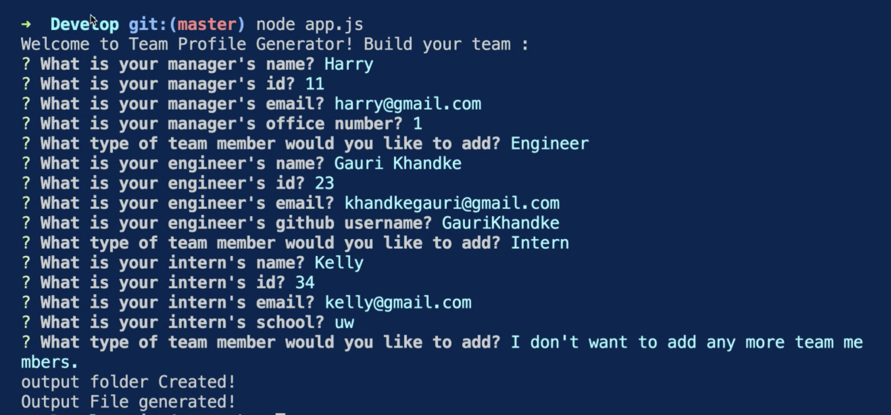
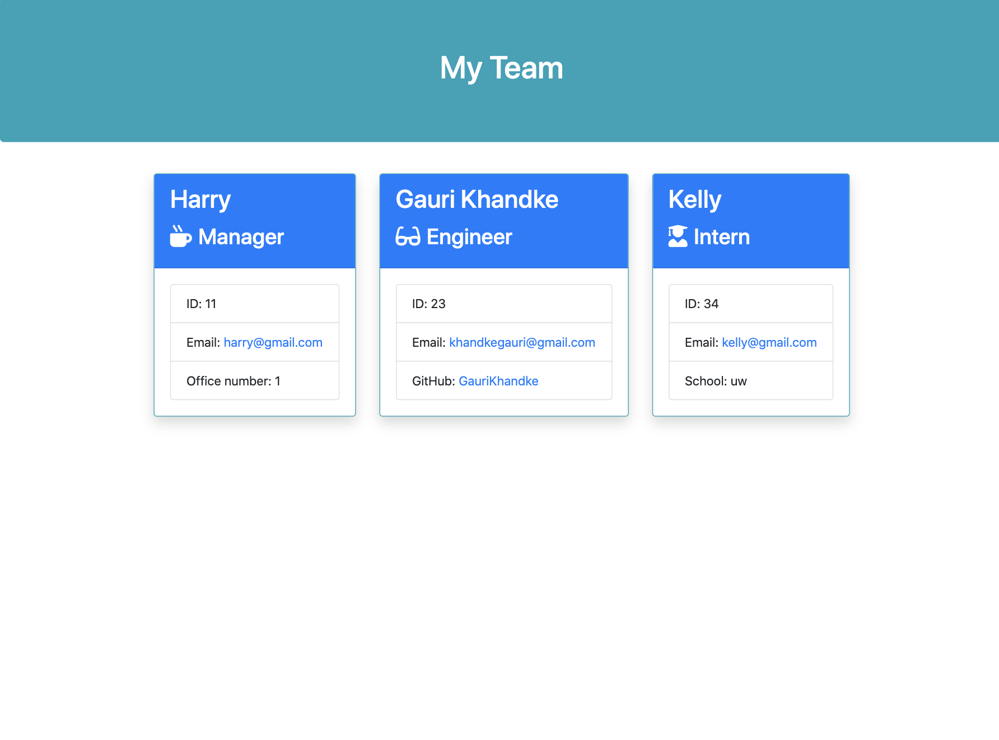

# Team-Profile-Generator


# Description

Team profile generator is a node command line application that takes in information about employees using the [Inquirer package](https://www.npmjs.com/package/inquirer) and generates an HTML webpage that displays summaries for each person.

# Motivation

One of the most important aspects of programming is writing code that is readable, reliable, and maintainable. Oftentimes, *how* we design our code is just as important as the code itself.

# Table of Contents
* [Technology](#technology)
* [Installation](#installation)
* [Usage](#usage)
* [Features](#features)
* [License](#license)
* [Contribution](#contribution)
* [Questions](#questions)

# Demo

# Screenshots

|Terminal|Generated Team Page
|--|--
||

## User Story

```
As a manager
I want to generate a webpage that displays my team's basic info
so that I have quick access to emails and GitHub profiles
```

# Technology

**1. [Node.js](https://nodejs.org/en/)** : 

Node.js is an open-source and cross-platform JavaScript runtime environment. A Node.js app is run in a single process, without creating a new thread for every request. Node.js provides a set of asynchronous I/O primitives in its standard library that prevent JavaScript code from blocking.

**2. [Inquirer NPM package](https://www.npmjs.com/package/inquirer)** :

Inquirer.js strives to be an easily embeddable and beautiful command line interface for Node.js. 

**3. [Jest NPM Package](https://www.npmjs.com/package/jest)** : 

* Delightful JavaScript Testing
* Complete and ready to set-up JavaScript testing solution.
* Failed tests run first. Fast interactive mode can switch between running all tests or only test files related to changed files.

# Installation 

* Clone this repository to use this application.
* Navigate to the 'Develop' folder. To install necessary dependencies, run the following command :

```
npm i
```

* Run this command to check all tests pass:

```
npm run test
```

* The application will be invoked with the following command:

```
node app.js
```

# Usage

* Run  commands listed in [Installation](#installation).
* Running `node app.js` command will prompt user or manager series of questions to build team.
* Once user finished building team, a HTML page 'team.html' will be generated in the 'output' folder.
* Open this HTML file in the browser to see your team page.

# Features : 

1. Used Node.js to build application which generates 'team.html' file dynamically by user's input.
2. Npm package '[Inquirer](https://www.npmjs.com/package/inquirer)' is used.
3. '[Jest NPM Package](https://www.npmjs.com/package/jest)' is used to follow test driven development and ensured that all tests pass.
4. Validated user input for email, ID's and office number.

# License

This project is licensed under MIT license.

# Contribution

Pull requests are always welcome!

# Questions
* If you have any questions about the repo, 
[open an issue](https://github.com/GauriKhandke/Team-Profile-Generator/issues) 
or contact me directly at [Email](mailto:khandkegauri@gmail.com). 
